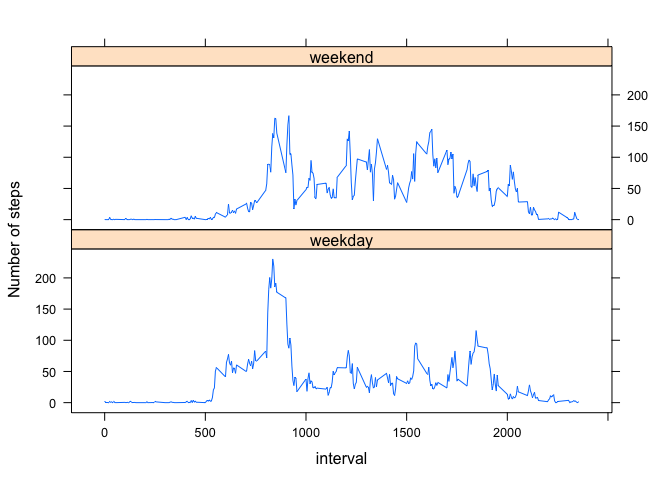

# Reproducible Research: Peer Assessment 1


## Loading and preprocessing the data


```r
mydata =  read.csv("activity.csv")
NAout <- na.omit(mydata)
```


## What is mean total number of steps taken per day?


```r
StepsByDay <-  aggregate(steps ~ date, mydata, sum)
barplot(StepsByDay$steps, names.arg = StepsByDay$date, xlab = "day", ylab = "Steps", main = "Steps By Day" )
```

<!-- -->


### Mean and Medians of steps / day


```r
mymean <- mean(StepsByDay$steps)
mymean
```

```
## [1] 10766.19
```

```r
mymedian <- median(StepsByDay$steps)
mymedian
```

```
## [1] 10765
```

```r
barplot(StepsByDay$steps, names.arg = StepsByDay$date, xlab = "day", ylab = "Steps", main = "Steps By Day" )
abline(h = mymean, lwd=3, lty = 1, col="red")
abline(h = mymedian, lwd=3, lty = 3, col="blue")
legend("top", legend= c("Mean", "Median"), lwd=2, col = c("red", "blue"), bty = "n")
```

<!-- -->

## What is the average daily activity pattern?

```r
stepsAvg <- aggregate(NAout$steps, list(NAout$interval), mean)
names(stepsAvg) = c("interval", "Average_activity")

plot(Average_activity ~ interval, stepsAvg, type ="l")
maxinterval <- stepsAvg$interval[which.max(stepsAvg$Average_activity)]
maxinterval
```

```
## [1] 835
```

```r
abline(v = maxinterval, col = "blue")
legend("topright", legend = "Max interval: 835", lwd=2, col="blue", bty="n")
```

<!-- -->

Interval that contains  maximum number of steps is 835

## Imputing missing values
Total number of row with NA:

```r
sum(is.na((mydata)))
```

```
## [1] 2304
```
        
My strategy for filling in all of the missing values in the dataset is to take the mean for this 5 minutes interval

```r
mydata2 <-  mydata
for(i in 1:nrow(mydata2)){
        if(is.na(mydata2$steps[i])){ 
                mydata2$steps[i] <- stepsAvg[which(stepsAvg$interval == mydata2$interval[i]),]$Average_activity
        }
}


mydata3 <- aggregate(steps~date, mydata2, sum)
```
News Mean and Median: 

```r
newmean <- mean(mydata3$steps)
newmean
```

```
## [1] 10766.19
```

```r
newmedian <- median(mydata3$steps)
newmedian
```

```
## [1] 10766.19
```

```r
barplot(mydata3$steps, names.arg = mydata3$date, xlab = "day", ylab = "Steps", main = "Steps By Day (no NA)" )
abline(h = newmean, lwd=3, lty = 1, col="red")
abline(h = newmedian, lwd=3, lty = 3, col="blue")
legend("top", legend= c("Mean", "Median"), lwd=2, col = c("red", "blue"), bty = "n")
```

<!-- -->


For mean, values don't differ. It's 10766.19 for all.
For median, first median is 10765 for first and 10766.19 for second.

So after imputing data, the effect is that median increase. (of 1.19 in our case)

## Are there differences in activity patterns between weekdays and weekends?


```r
mydata4 <- mydata2
mydata4$days <- factor(format(as.Date(mydata4$date), "%A")) 
head(mydata4$days)
```

```
## [1] Lundi Lundi Lundi Lundi Lundi Lundi
## Levels: Dimanche Jeudi Lundi Mardi Mercredi Samedi Vendredi
```

```r
levels(mydata4$days) <- list(weekday = c("Lundi", "Mardi", "Mercredi", "Jeudi", "Vendredi"),
                             weekend = c("Samedi", "Dimanche"))

levels(mydata4$days)
```

```
## [1] "weekday" "weekend"
```

```r
table(mydata4$days)
```

```
## 
## weekday weekend 
##   12960    4608
```
Let's draw panel plot :


```r
library(lattice)
moyenne <- aggregate(mydata4$step, list(interval = mydata4$interval,
days = mydata4$days), mean)
names(moyenne)[3] <-  "mean_steps"

xyplot(moyenne$mean_steps ~ moyenne$interval | moyenne$days, type = "l", layout = c(1,2), xlab = "interval", ylab="Number of steps")
```

<!-- -->
